<div align="center">

# Claude Pres Builder

**Turn YAML into stunning, branded PowerPoint decks — in seconds.**

Define your slides in YAML. Get a pixel-perfect, brand-compliant PPTX with 47 layout types, automated quality checks, and full theme control.

Built with and for [Claude Code](https://claude.ai/claude-code).

</div>

---

### One YAML. Three brands. Zero design work.

<table>
<tr>
<td width="33%">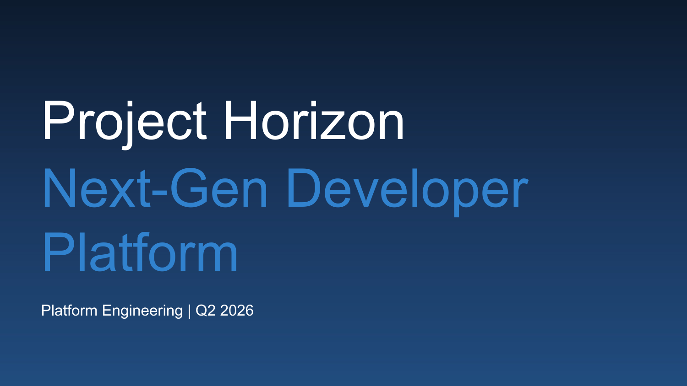<br><sub>Generic</sub></td>
<td width="33%">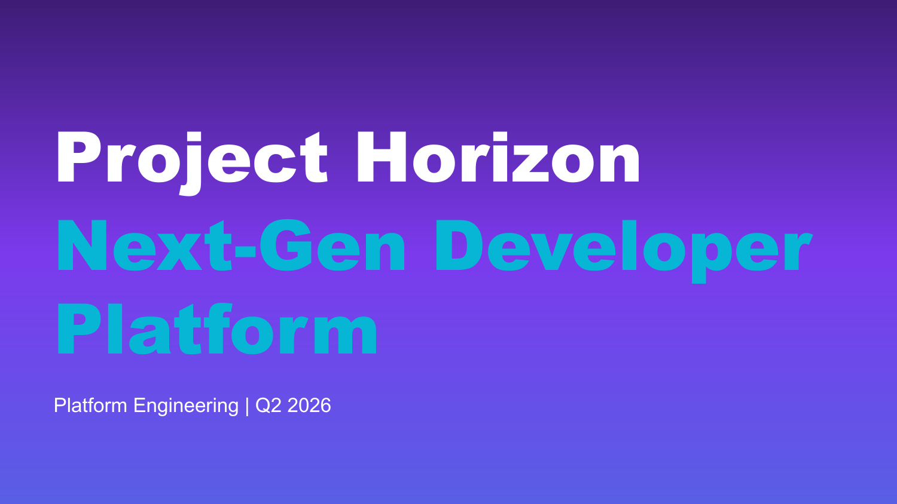<br><sub>Tech Gradient</sub></td>
<td width="33%">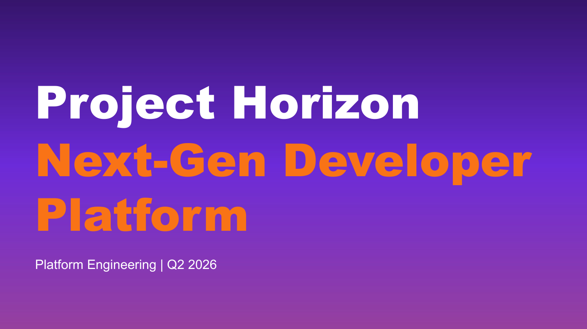<br><sub>Startup Bold</sub></td>
</tr>
</table>

Same YAML definition, completely different visual identities. Switch brands with a single line:

```yaml
brand: generic        # navy/blue, clean, professional
brand: tech-gradient  # purple/cyan, bold, modern
brand: startup        # purple/orange, energetic, bold
```

---

## Why Claude Pres Builder?

| | |
|---|---|
| **47 Layout Types** | Title covers, agendas, KPI dashboards, roadmaps, comparison matrices, process flows, funnel charts, bento grids, and 39 more. Every layout is manually rendered on a clean canvas for pixel-perfect control. |
| **Brand System** | Full OOXML theme support — 12 color slots, 2 font slots, background images, gradient generation. Ship with 6 built-in brands or onboard your own from any PPTX template. |
| **Automated QA** | 15+ structural checks catch overflow, tiny fonts, empty boxes, broken icons, and story structure issues before you ship. Optional Claude vision review for spacing and alignment. |
| **Template Agnostic** | Works with any PPTX template — standard 10" slides, Google Slides 20" canvas, even A4 landscape. Canvas scaling and layout mapping handle it automatically. |
| **Claude-Native** | Designed to be driven by Claude Code. Describe the deck you want in natural language, get a polished PPTX back. The YAML format is optimized for LLM generation. |

---

## Quick Start

```bash
# 1. Set up Python environment
python3 -m venv /tmp/pres-venv
/tmp/pres-venv/bin/pip install python-pptx pyyaml Pillow

# 2. Build a deck
/tmp/pres-venv/bin/python3 build_deck.py examples/showcase-generic.yaml

# 3. Build with proof images (requires LibreOffice)
/tmp/pres-venv/bin/python3 test_deck.py examples/showcase-generic.yaml --proof-images
```

That's it. Open the generated `.pptx` in PowerPoint, Google Slides, or LibreOffice.

---

## What You Can Build

### Content slides that actually communicate

<table>
<tr>
<td width="50%">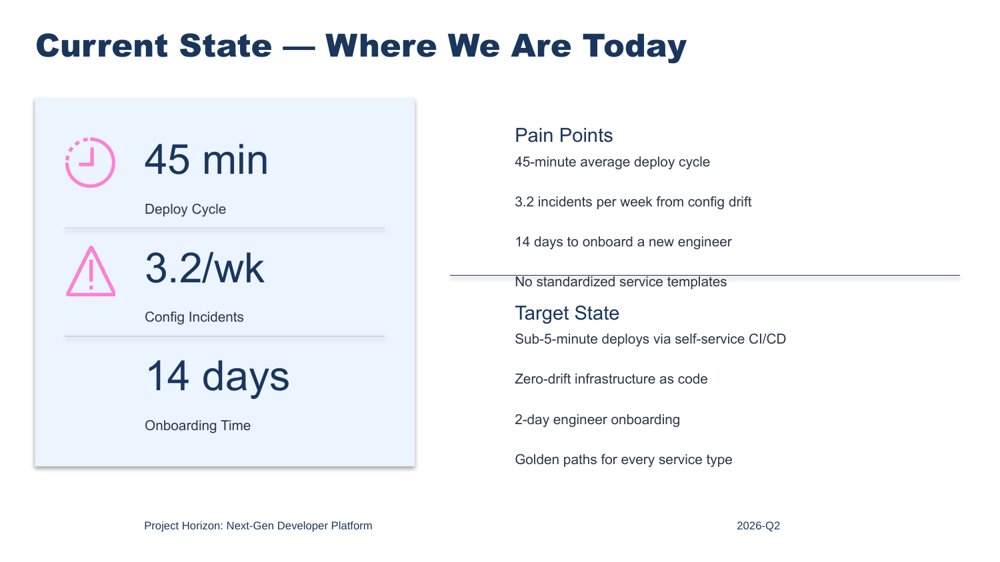<br><sub><b>Two-Column with Stats</b> — Pain points vs. target state</sub></td>
<td width="50%">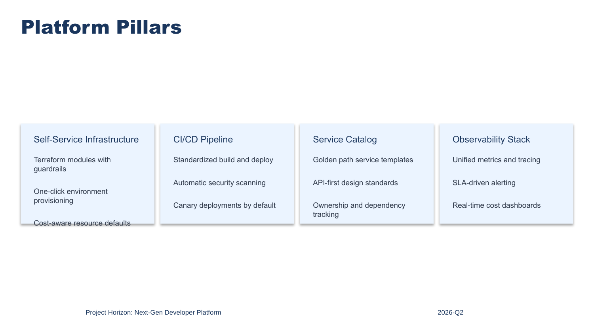<br><sub><b>Card Grid</b> — Strategic pillars with details</sub></td>
</tr>
<tr>
<td width="50%">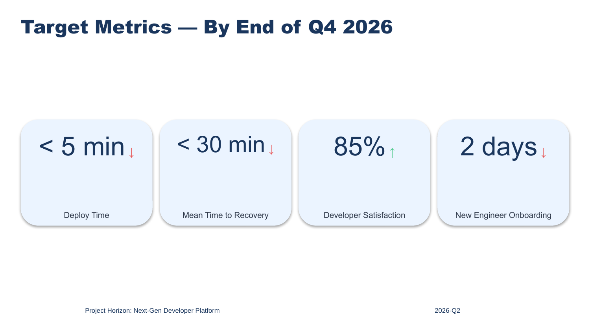<br><sub><b>KPI Dashboard</b> — Metrics with trend indicators</sub></td>
<td width="50%">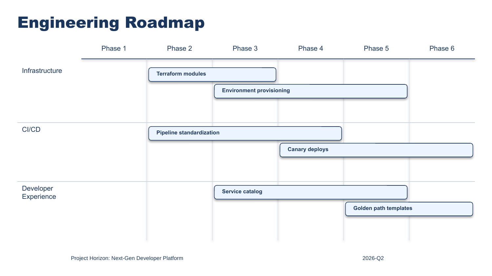<br><sub><b>Roadmap</b> — Swimlanes with milestones</sub></td>
</tr>
<tr>
<td width="50%">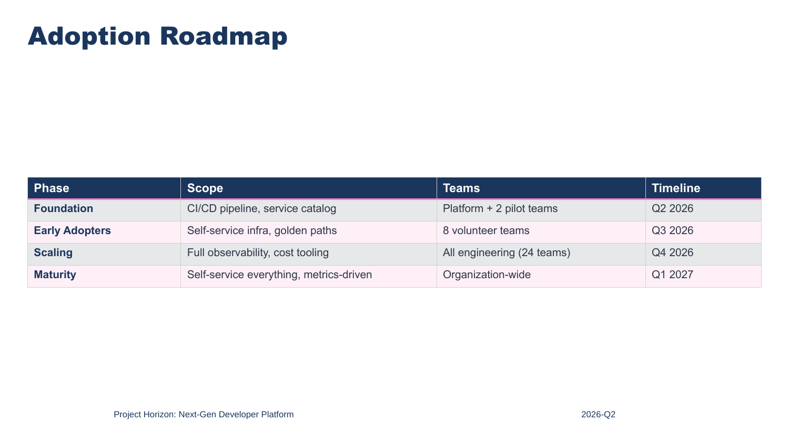<br><sub><b>Table</b> — Auto-sized columns and rows</sub></td>
<td width="50%">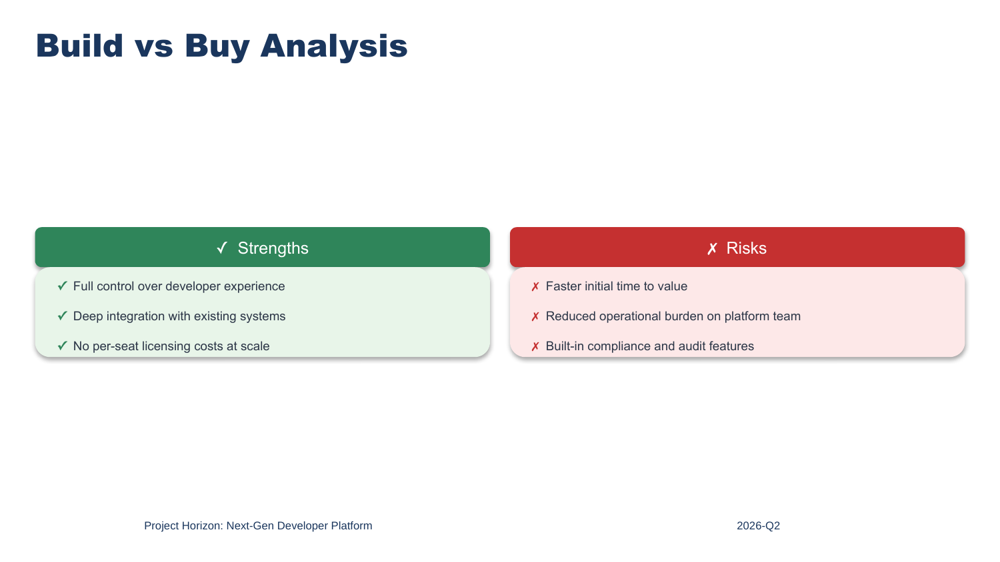<br><sub><b>Pros / Cons</b> — Build vs. buy analysis</sub></td>
</tr>
</table>

### Same content, different brand

<table>
<tr>
<td width="33%"><br><sub>Generic</sub></td>
<td width="33%">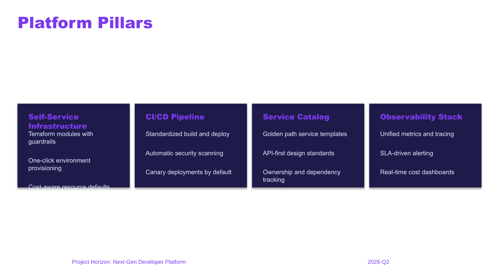<br><sub>Tech Gradient</sub></td>
<td width="33%">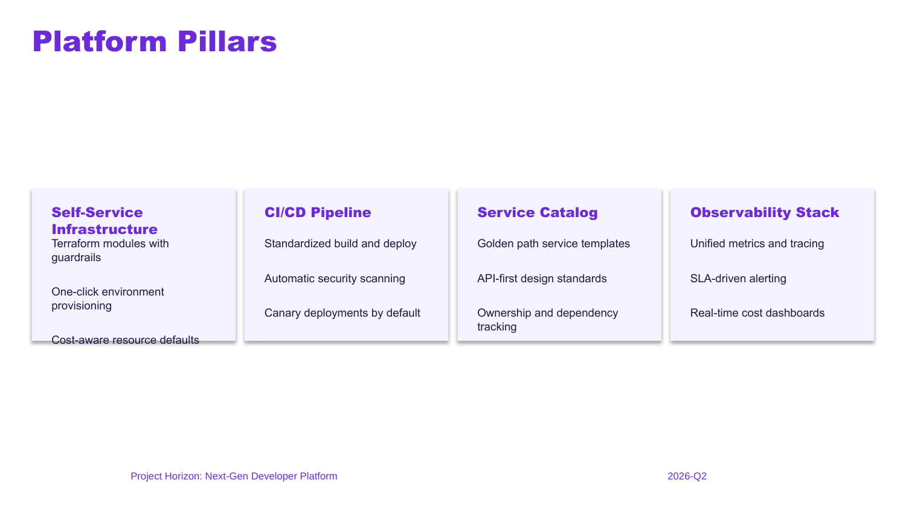<br><sub>Startup Bold</sub></td>
</tr>
<tr>
<td width="33%"><br><sub>Generic</sub></td>
<td width="33%">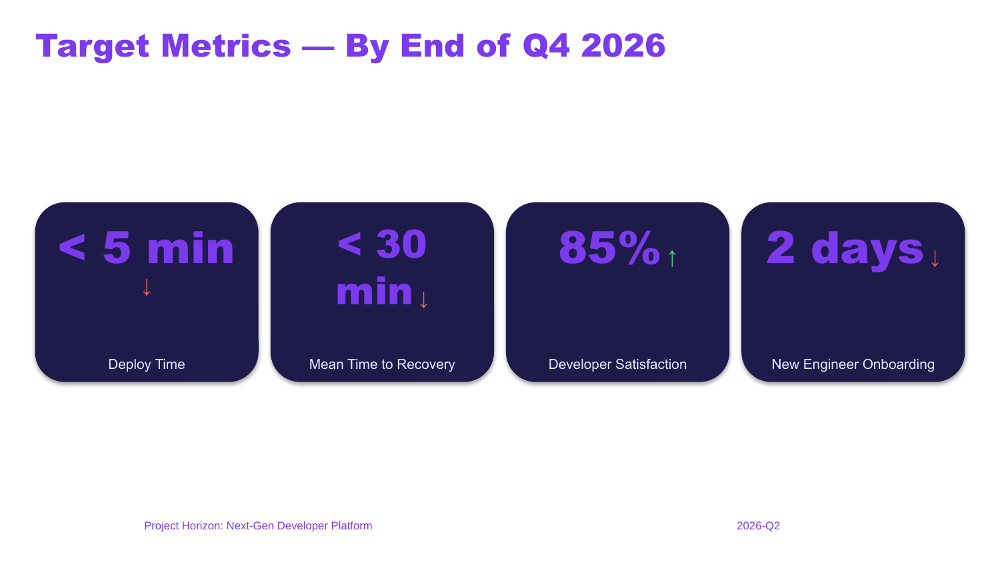<br><sub>Tech Gradient</sub></td>
<td width="33%">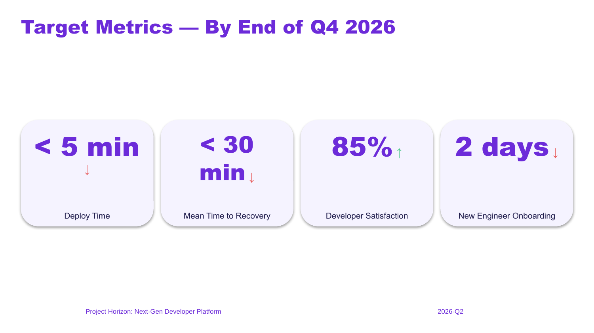<br><sub>Startup Bold</sub></td>
</tr>
</table>

---

## YAML Format

A deck is a YAML file with a title, date, brand, and a list of slides:

```yaml
title: "Project Horizon: Next-Gen Developer Platform"
date: 2026-Q2
brand: generic

slides:
- layout: title_cover
  headline: "Project Horizon — Next-Gen Developer Platform"
  subheader: Platform Engineering | Q2 2026

- layout: four_card
  headline: Platform Pillars
  cards:
  - title: Self-Service Infrastructure
    body: "Terraform modules with guardrails\nOne-click provisioning"
  - title: CI/CD Pipeline
    body: "Standardized build and deploy\nCanary deployments by default"
  - title: Service Catalog
    body: "Golden path templates\nOwnership tracking"
  - title: Observability
    body: "Unified metrics and tracing\nSLA-driven alerting"

- layout: kpi_dashboard
  headline: Target Metrics
  kpis:
  - number: "< 5 min"
    label: Deploy Time
    trend: down
  - number: 85%
    label: Developer Satisfaction
    trend: up

- layout: closing
  headline: Questions?
  subheader: Platform Engineering Team
```

See [presentation-guide.md](presentation-guide.md) for all 47 layouts, field reference, and formatting options.

---

## 47 Layout Types

### Structural
`title_cover` | `agenda` | `section_divider` | `closing`

### Content
`content_two_col` | `content_stacked` | `content_diagram_text` | `side_by_side` | `three_column` | `four_card` | `numbered_list` | `before_after` | `bold_bullet` | `image_text_hero`

### Data & Metrics
`content_table` | `kpi_dashboard` | `big_stat` | `status_board` | `matrix`

### Comparison & Analysis
`pros_cons` | `comparison_matrix` | `quadrant` | `pricing_table`

### Process & Timeline
`roadmap` | `process_flow` | `staircase` | `funnel` | `cycle_diagram` | `hub_spoke`

### Charts & Visualization
`donut_rings` | `pyramid` | `venn` | `waterfall` | `gauge_dashboard` | `risk_heat_map` | `tornado_chart` | `radar_chart` | `combo_chart` | `bubble_chart` | `concentric_circles`

### Composite
`bento_grid` | `dashboard_panel` | `left_nav_sidebar` | `team_profiles`

### Special
`quote` | `callout`

---

## Brand System

### Built-in brands

| Brand | Colors | Fonts | Personality |
|-------|--------|-------|-------------|
| **generic** | Navy / Blue | Arial | Clean, professional, universal |
| **startup** | Purple / Orange | Arial Black | Bold, energetic, modern |
| **tech-gradient** | Purple / Cyan | Arial Black | Technical, futuristic |
| **academic** | Navy / Crimson | Georgia / Palatino | Scholarly, authoritative |
| **government** | Navy / Steel Blue | Arial | Formal, institutional |
| **earth** | Brown / Amber | Georgia | Warm, natural, grounded |

### Create your own brand

```bash
# Onboard from an existing PPTX template
python3 onboard_cli.py --name "mycompany" --template path/to/template.pptx

# Or from a collection of company decks
python3 onboard_cli.py --name "mycompany" --corpus path/to/decks/
```

The onboarding wizard extracts your theme colors, fonts, images, and icons into a brand package. Then just reference it:

```yaml
brand: mycompany
```

### Brand package structure

```
brands/mycompany/
  brand.yaml           # Color tokens, font names, image paths
  theme.json           # Full OOXML 12-slot theme
  template.pptx        # PPTX with your theme baked in
  layout_mapping.json   # Template layout structure
  title-assets/        # Background images
  icons/               # Custom icon catalog
```

---

## QA Pipeline

Every build can include automated quality checks:

```bash
# Build with QA report
python3 test_deck.py deck.yaml --proof-images

# Build with Claude vision review
python3 test_deck.py deck.yaml --proof-images --ai-review

# Strict mode — fails on critical issues
python3 test_deck.py deck.yaml --proof-images --strict
```

**Structural checks:** word count limits, font size floor (7pt), text overflow detection, cross-slide consistency, story structure validation, audience density validation.

**Visual checks:** proof PNGs with overlap detection, margin violations, containment verification.

**AI review (optional):** sends each slide to Claude for spacing, alignment, and readability feedback.

---

## Text Formatting

Body text supports markdown-style formatting:

```yaml
left_body: |
  **Key metric:** 99.95% uptime SLA
  
  - Zero-drift infrastructure as code
  - [Cloud Services Portal](https://example.com/portal)
  - Sub-5-minute deploy cycles
```

Supports **bold**, `- bullets`, `[named links](url)`, and bare URL auto-detection. All formats can be combined freely.

---

## Architecture

```
build_deck.py           # Core builder — YAML to PPTX (47 layouts)
test_deck.py            # Build harness — proof images, QA, upload
qa_pipeline.py          # 15+ automated quality checks
proof_renderer.py       # LibreOffice headless + PIL proof rendering
extract_layout_mapping.py  # Template layout analysis
patch_template_theme.py # Theme extract / derive / inject
onboard_cli.py          # Brand onboarding CLI
onboard_wizard.py       # Browser-based onboarding wizard
brands/                 # Brand packages (yaml + theme + template)
examples/               # Showcase decks for each brand
diagrams/               # Diagram engine (native + draw.io + AI)
```

---

## Requirements

- **Python 3.10+**
- **python-pptx**, **pyyaml**, **Pillow** (core)
- **LibreOffice** (optional, for proof image rendering)
- **Claude Code** (optional, for AI-driven deck creation and vision QA)

```bash
python3 -m venv /tmp/pres-venv
/tmp/pres-venv/bin/pip install python-pptx pyyaml Pillow
```

---

## Using with Claude Code

Claude Pres Builder is designed to work with [Claude Code](https://claude.ai/claude-code). Point Claude at your project and ask:

> "Build me a 10-slide deck on our Q2 platform engineering strategy. Use the startup brand."

Claude reads the presentation guide, writes the YAML, builds the PPTX, runs QA, and iterates until it's right.

The YAML format is deliberately LLM-friendly — structured enough for precise control, readable enough for Claude to generate correctly on the first try.

---

## License

MIT

---

<div align="center">
<sub>Built with Claude Code</sub>
</div>
